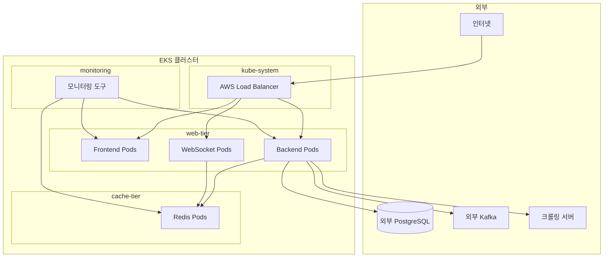

# EKS Migration - Ingress 및 Network Policy 설정

## 개요

이 문서는 EKS 마이그레이션 프로젝트의 Task 5 "Ingress 및 네트워크 설정"에 대한 구현 내용을 설명합니다.

## 구성 요소

### 1. Ingress 리소스 (`07-ingress-resources.yaml`)

#### 1.1 web-tier-ingress (프로덕션용)
- **목적**: 외부 트래픽을 web-tier 네임스페이스의 서비스로 라우팅
- **특징**:
  - Internet-facing ALB 생성
  - HTTPS 리다이렉트 지원
  - SSL/TLS 인증서 설정 준비
  - Next.js SPA 라우팅 지원

#### 1.2 web-tier-dev-ingress (개발/테스트용)
- **목적**: 개발 환경에서 HTTP 전용 접근
- **특징**:
  - HTTP 전용 (SSL 인증서 불필요)
  - 간단한 설정으로 빠른 테스트 가능

#### 1.3 monitoring-ingress (내부 모니터링용)
- **목적**: 내부 모니터링 도구 접근
- **특징**:
  - Internal ALB (VPC 내부에서만 접근 가능)
  - Redis 메트릭 및 모니터링 대시보드 접근

### 2. Network Policy (`08-network-policies.yaml`)

#### 2.1 web-tier-network-policy
- **적용 대상**: web-tier 네임스페이스의 모든 Pod
- **허용 트래픽**:
  - Ingress: ALB → Frontend/Backend/WebSocket
  - Egress: → cache-tier (Redis), 외부 서비스 (DB, Kafka, 크롤링 서버)

#### 2.2 cache-tier-network-policy
- **적용 대상**: cache-tier 네임스페이스의 모든 Pod (Redis)
- **허용 트래픽**:
  - Ingress: web-tier → Redis
  - Egress: Redis 클러스터 내부 통신

#### 2.3 monitoring-network-policy
- **적용 대상**: monitoring 네임스페이스의 모든 Pod
- **허용 트래픽**:
  - Ingress: ALB → 모니터링 도구
  - Egress: → 메트릭 수집 대상 (web-tier, cache-tier)

## 라우팅 규칙

### HTTP 경로 라우팅

| 경로 | 대상 서비스 | 포트 | 설명 |
|------|-------------|------|------|
| `/api` | backend-service | 3001 | REST API 엔드포인트 |
| `/ws` | websocket-service | 3002 | WebSocket 연결 |
| `/health` | frontend-service | 3000 | 헬스체크 엔드포인트 |
| `/_next` | frontend-service | 3000 | Next.js 정적 자산 |
| `/` | frontend-service | 3000 | Next.js 애플리케이션 (fallback) |

### Next.js SPA 라우팅 지원

- **문제**: React Router의 히스토리 모드에서 직접 URL 접근 시 404 오류
- **해결**: 모든 알려지지 않은 경로를 Frontend 서비스로 라우팅하여 클라이언트 사이드 라우팅 처리

## 보안 설정

### Network Policy 보안 모델



### 보안 원칙

1. **최소 권한 원칙**: 필요한 통신만 허용
2. **네임스페이스 격리**: 각 계층별 네임스페이스 분리
3. **외부 접근 제한**: ALB를 통해서만 외부 접근 허용
4. **내부 통신 제어**: Network Policy로 Pod 간 통신 제어

## 배포 방법

### 1. 사전 요구사항 확인

```bash
# 필수 네임스페이스 존재 확인
kubectl get namespaces web-tier cache-tier monitoring

# AWS Load Balancer Controller 설치 확인
kubectl get deployment aws-load-balancer-controller -n kube-system
```

### 2. 배포 실행

#### PowerShell (Windows)
```powershell
# 기본 배포
.\k8s-manifests\deploy-ingress-network.ps1

# ALB Controller 확인 건너뛰기
.\k8s-manifests\deploy-ingress-network.ps1 -SkipALBCheck

# Dry Run (실제 배포 없이 확인)
.\k8s-manifests\deploy-ingress-network.ps1 -DryRun
```

#### Bash (Linux/macOS)
```bash
# 실행 권한 부여
chmod +x k8s-manifests/deploy-ingress-network.sh

# 배포 실행
./k8s-manifests/deploy-ingress-network.sh
```

### 3. 배포 검증

```powershell
# 기본 검증
.\k8s-manifests\verify-ingress-network.ps1

# 특정 ALB 도메인으로 연결 테스트
.\k8s-manifests\verify-ingress-network.ps1 -ALBDomain "your-alb-domain.amazonaws.com"

# 연결 테스트 건너뛰기
.\k8s-manifests\verify-ingress-network.ps1 -SkipConnectivityTest
```

## 트러블슈팅

### 1. ALB 생성 실패

**증상**: Ingress 리소스는 생성되었지만 ALB가 생성되지 않음

**확인 사항**:
```bash
# AWS Load Balancer Controller 로그 확인
kubectl logs -n kube-system deployment/aws-load-balancer-controller

# Ingress 이벤트 확인
kubectl describe ingress web-tier-ingress -n web-tier
```

**해결 방법**:
- IAM 역할 및 권한 확인
- 서브넷 태그 확인 (`kubernetes.io/role/elb=1`)
- 보안 그룹 설정 확인

### 2. 서비스 연결 실패

**증상**: ALB는 생성되었지만 서비스에 연결되지 않음

**확인 사항**:
```bash
# 서비스 및 엔드포인트 확인
kubectl get services -n web-tier
kubectl get endpoints -n web-tier

# Pod 상태 확인
kubectl get pods -n web-tier
```

**해결 방법**:
- 서비스 셀렉터와 Pod 레이블 일치 확인
- Pod의 readinessProbe 상태 확인
- 포트 번호 일치 확인

### 3. Network Policy 통신 차단

**증상**: Pod 간 통신이 차단됨

**확인 사항**:
```bash
# Network Policy 확인
kubectl get networkpolicy -A
kubectl describe networkpolicy web-tier-network-policy -n web-tier

# Pod 간 연결 테스트
kubectl exec -it <pod-name> -n web-tier -- curl <target-service>:port
```

**해결 방법**:
- Network Policy 규칙 검토
- 네임스페이스 레이블 확인
- 포트 및 프로토콜 설정 확인

### 4. SSL/TLS 인증서 설정

**프로덕션 환경에서 HTTPS 설정**:

1. ACM에서 SSL 인증서 생성
2. `07-ingress-resources.yaml` 수정:
   ```yaml
   annotations:
     alb.ingress.kubernetes.io/certificate-arn: arn:aws:acm:region:account:certificate/cert-id
   ```
3. 도메인 설정 (Route 53)
4. Ingress 리소스 업데이트

## 모니터링 및 유지보수

### 1. 정기 점검 항목

- ALB 상태 및 대상 그룹 헬스
- Network Policy 효과성
- SSL 인증서 만료일
- 보안 그룹 규칙

### 2. 로그 모니터링

```bash
# AWS Load Balancer Controller 로그
kubectl logs -f -n kube-system deployment/aws-load-balancer-controller

# Ingress 이벤트 모니터링
kubectl get events -n web-tier --sort-by='.lastTimestamp'
```

### 3. 성능 최적화

- ALB 대상 그룹 설정 튜닝
- 헬스체크 간격 조정
- 연결 유지 시간 최적화
- 로드밸런싱 알고리즘 선택

## 참고 자료

- [AWS Load Balancer Controller 문서](https://kubernetes-sigs.github.io/aws-load-balancer-controller/)
- [Kubernetes Ingress 문서](https://kubernetes.io/docs/concepts/services-networking/ingress/)
- [Kubernetes Network Policies 문서](https://kubernetes.io/docs/concepts/services-networking/network-policies/)
- [Next.js 배포 가이드](https://nextjs.org/docs/deployment)